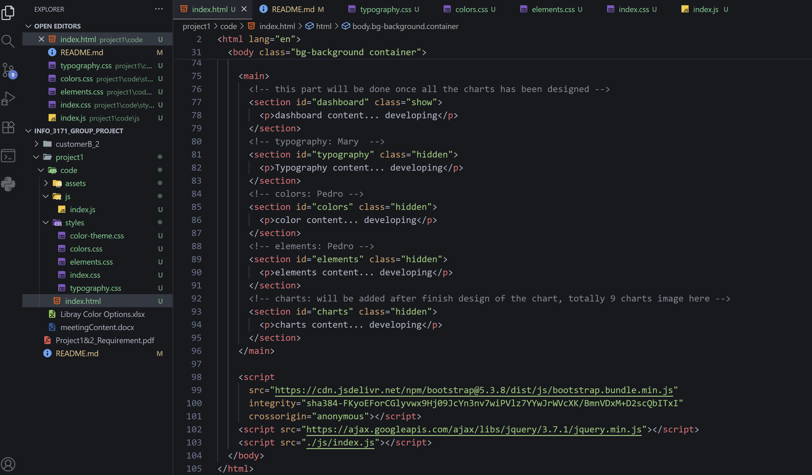

This is the repo of the group project of INFO-3171.

The meetingContent.docx file records the meeting content for each meeting.

This code dir includes all the code for the project, and so far the start point of the developing code has done.

Mary: use the /code/styles/typography.css for styling your content, and for you own class, please add `m_` as prefix, eg: m_container, m_box ... , and your html code should be added into line 81 - 83 for the typography section

Pedro: use the /code/styles/elements.css and /code/styles/colors for styling your content, and you class name will add `p_` as prefix, eg: p_container, p_wrapper ..., and your html code should be add into line 85-87 for color section and 89 - 91 for elements section

